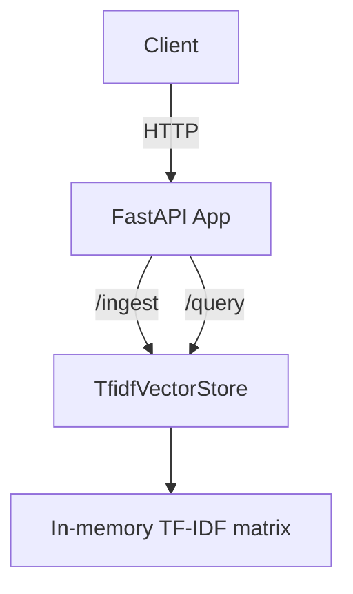
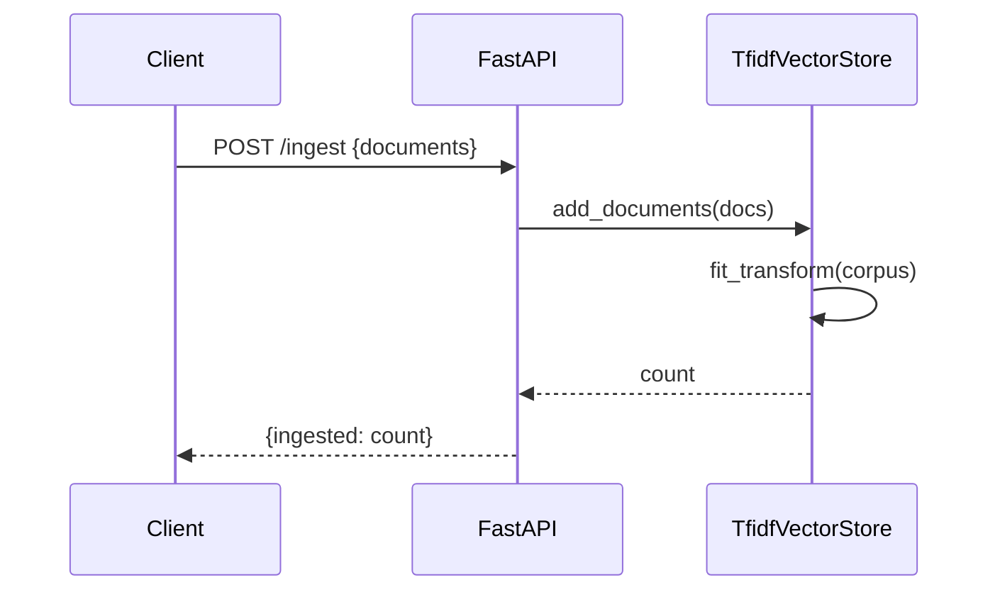
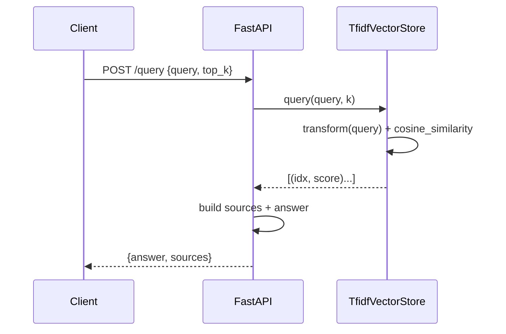

# Architecture (Initial → Evolving)

- Week 1: Monolith FastAPI app with in-process vector index (TF‑IDF)
- Week 2: MLflow tracking + DVC pipeline; local artifacts
- Week 3: Containerized service; K8s manifests; readiness/liveness
- Week 4: Observability: Prometheus metrics, Grafana dashboards, logs
- Week 5: Orchestration for retraining; evaluation gates
- Week 6: Progressive delivery (shadow/A/B), rollback

Links: see plan.md, slos.md, work-items.md

## Components (Week 1)
- Client (curl/TestClient)
- FastAPI app (`app.main`)
- Vector store (`app.vectorstore.TfidfVectorStore`)
- Schemas (`app.schemas`)

## Component Diagram

## Sequence — Ingest

## Sequence — Query

